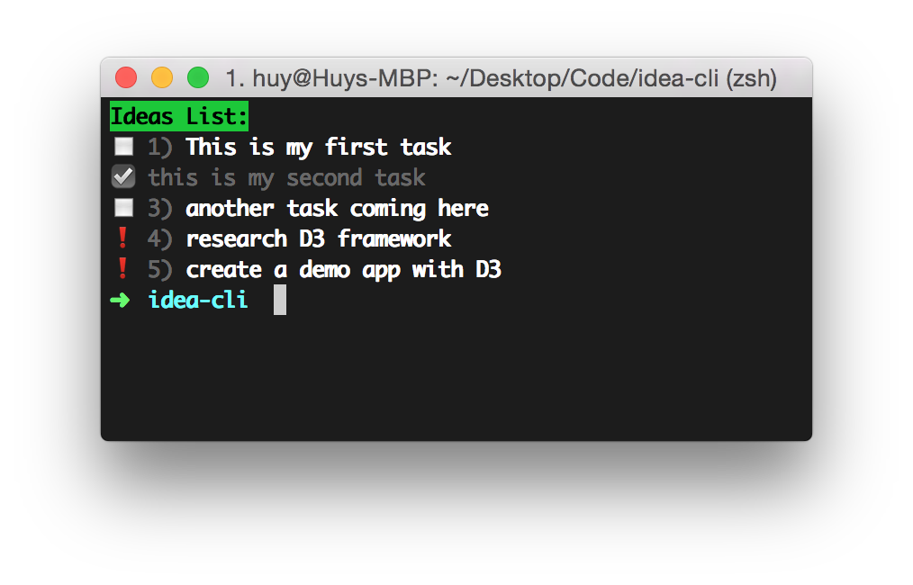

idea-cli
========
Command line based Task management tool



## Installation

Just run the `install.sh` script (as root if needed):

```
sh install.sh
```
or
```
sudo ./install.sh
```

## Usage
Just type this to see the task list
```
idea
```

**More commands:**
- **Add**: You can add task with `+`, `a`, `add` command, for example:

  ```
  idea + Hello World
  ```

- **Delete**: Delete task using `-` or `del` command:

  ```
  idea del 3
  ```

  or

  ```
  idea - task content here
  ```

- **Mark done**: Check the task as done with `ok` or `done`:

  ```
  idea ok 4
  ```

  or

  ```
  idea done task content
  ```

- **Mark as important**: Mark a task as important with `!` or `i` command:

  ```
  idea ! task name
  ```

  or

  ```
  idea i 5
  ```

- **Clear all tasks**: Clear all tasks with `clear` or `reset` command:

  ```
  idea clear
  ```
  
- **More**: Type `help` or something to see the help message for more command.
